# UDY-SQLSever-ZeroAAvanzado

## Seccion 13: Stored Procedures - T-SQL

### Video 100 Que es un Stored Procedure

La forma de tener un StoreProcedure, es entrando a la carpeta de Programmability

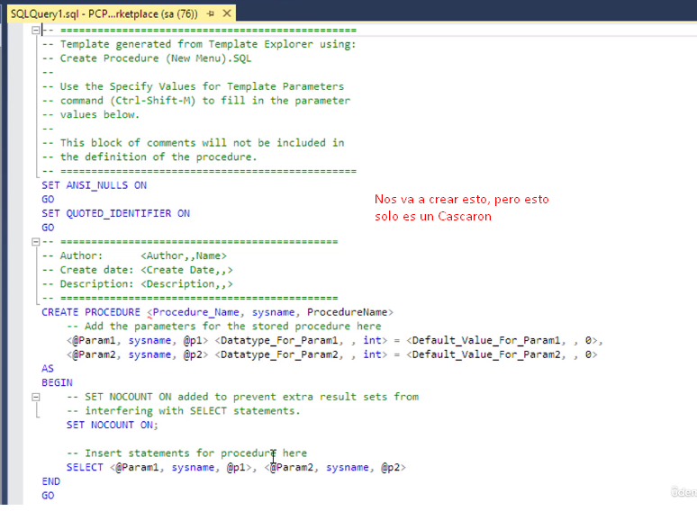

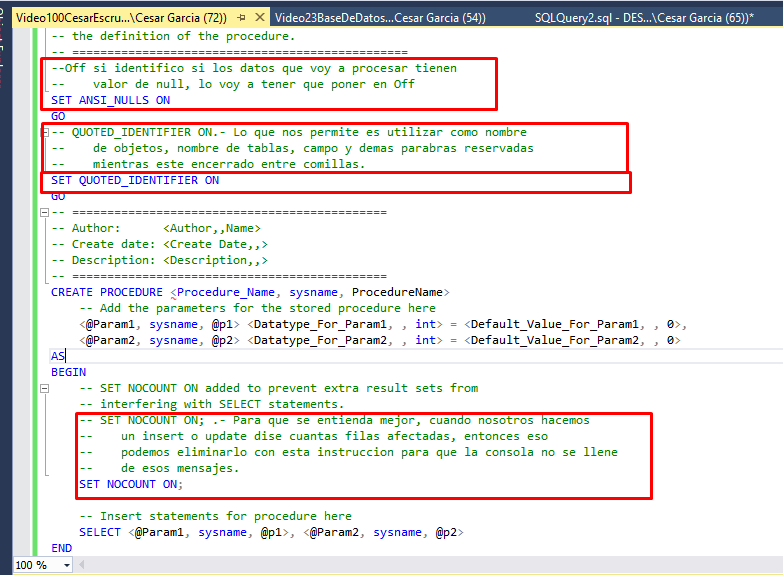

Creamos nuestro primer StoreProcedure y ejecutamos

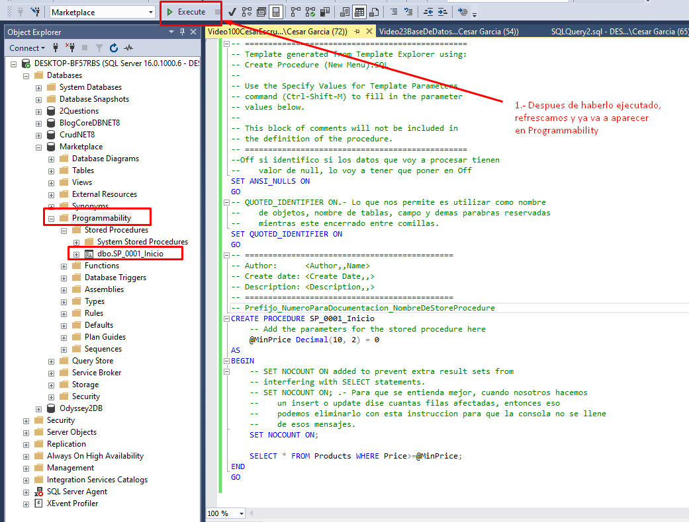

Ejecutamos el StoreProcedure con **EXEC** y lo corremos con F5 o el boton de Play

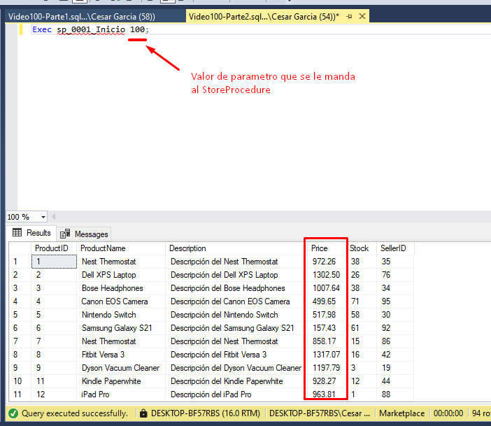

### Video 101 Parametros & Variables

* Para modificar el StoreProcedure hay que darle en Modify
  * 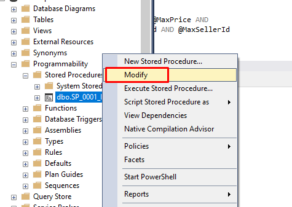
* Agregamos Variables Inicializadas y No inicializadas
  * 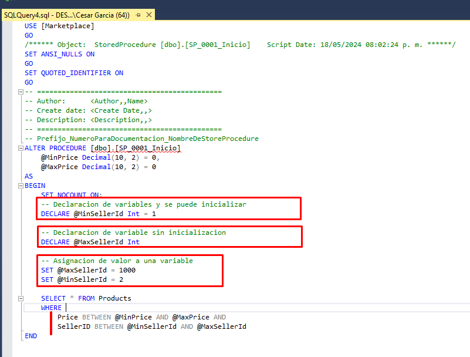
* Corremos
  * 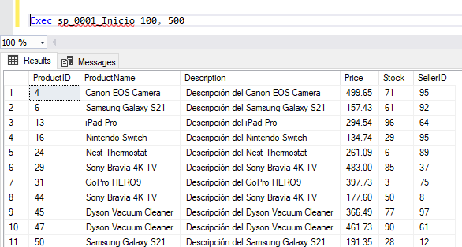

### Video 102 Escructuras de Decision (IF ELSE, CASE, EXISTS)

* If
  * 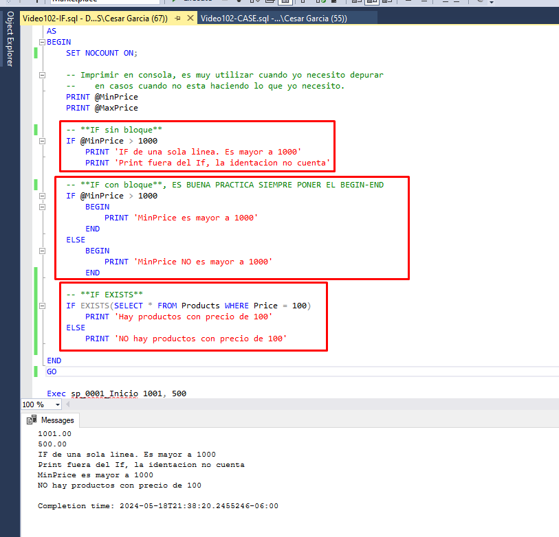
* CASE
  * 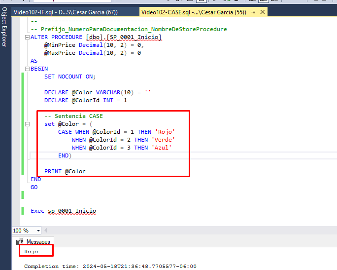

### Video 103 Escructuras de Iteracion (WHILE, RETURN & BREAK)

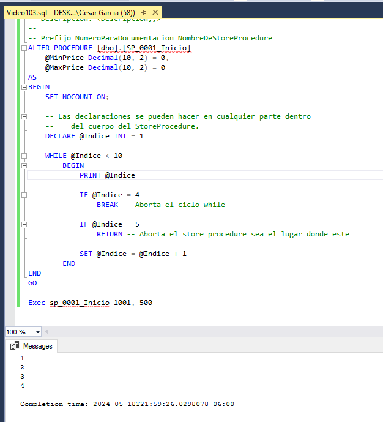

### Video 104 Uso de Cursores

Cursor podria ser como una especie de tabla en memoria a la cual voy a poder recorrer registro por registro

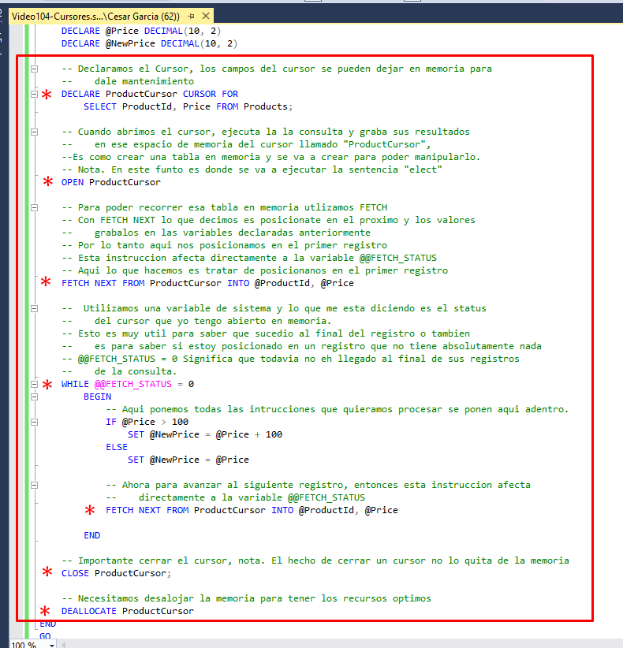

### Video 105 Manejo de Errores

* Ejemplo 1
  * 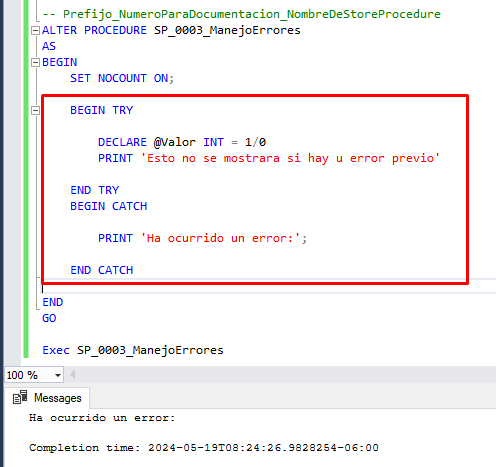
* Ejemplo 2
  * 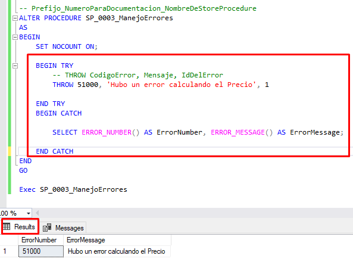
* Ejemplo 3
  * 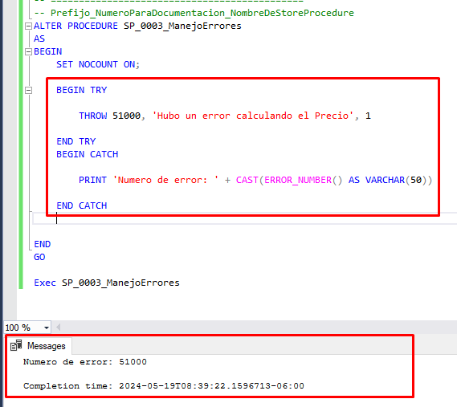

## Seccion 14: Creando Stored Procedures reales

### Video 106 Creando el SP de Descuentos por Stock

#### **Nuevo tema aprendido CURSOR_STATUS('global', 'ProductCursor')**

El uso de `CURSOR_STATUS` en SQL Server te permite determinar el estado de un cursor, lo que es útil para manejar adecuadamente los cursores en tus procedimientos almacenados, especialmente en bloques `TRY...CATCH`. Aquí te explico cómo funciona `CURSOR_STATUS` y cómo evaluarlo para asegurar que el cursor se cierre correctamente.

##### Funcionamiento de `CURSOR_STATUS`

La función `CURSOR_STATUS` devuelve el estado del cursor especificado. Los parámetros de `CURSOR_STATUS` son:

* **global/local:** Especifica si el cursor es global o local.
* **cursor_name:** El nombre del cursor.

##### Valores Devueltos por `CURSOR_STATUS`

`CURSOR_STATUS` puede devolver los siguientes valores:

* **1:** El cursor está abierto.
* **0:** El cursor está declarado, pero no abierto.
* **-1:** El cursor no existe o ha sido cerrado.

Lo que haremos

* 
* 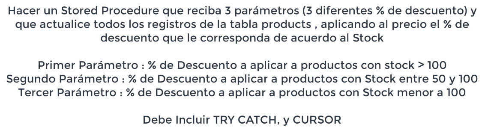
  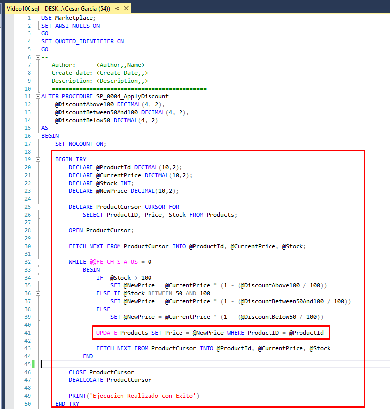
* 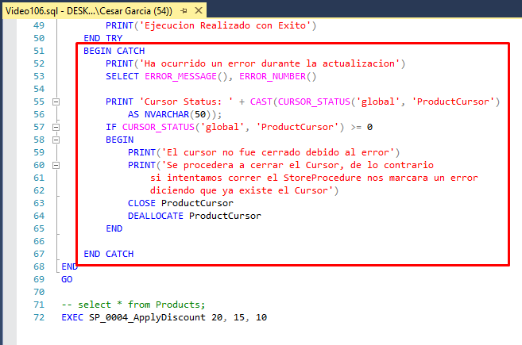

### Video 107 Creando el SP para actualizar Stock desde una venta

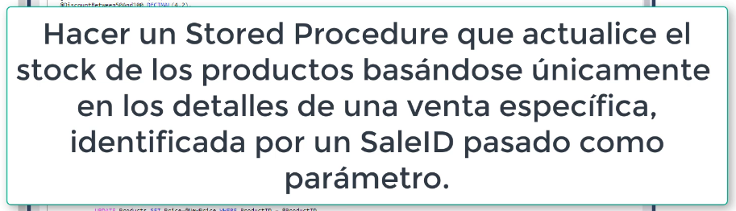

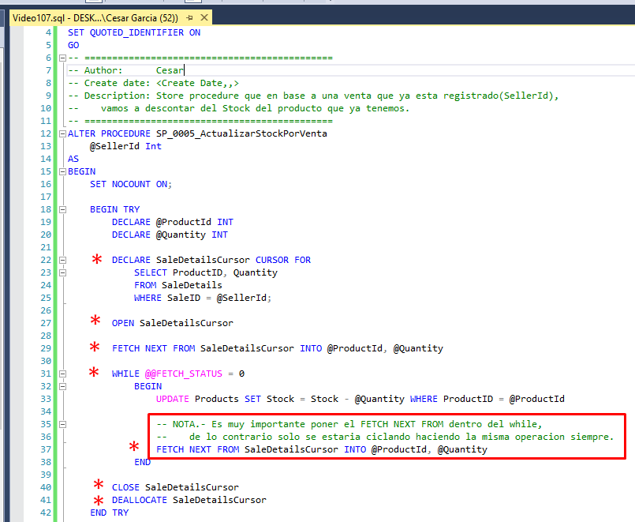

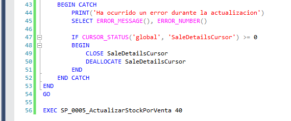

### Video 108 Creando el SP para listar sellers de mayor venta de acuerdo a un parametrov

### Video 109

### Video 110

### Video

### Video

### Video

### Video

### Video

### Video

### Video

### Video

### Video

### Video

### Video

### Video

### Video

### Video

### Video

### Video

### Video

### Video

### Video

### Video

### Video
