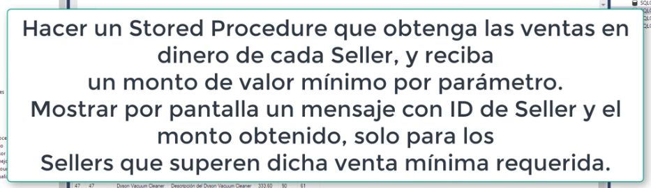
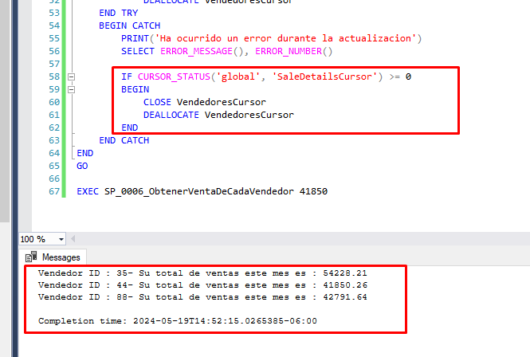
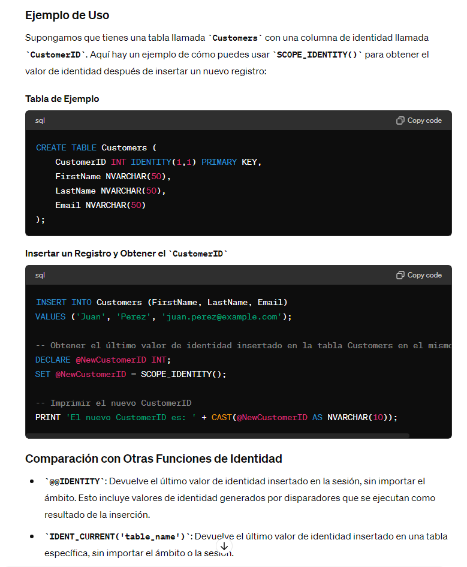
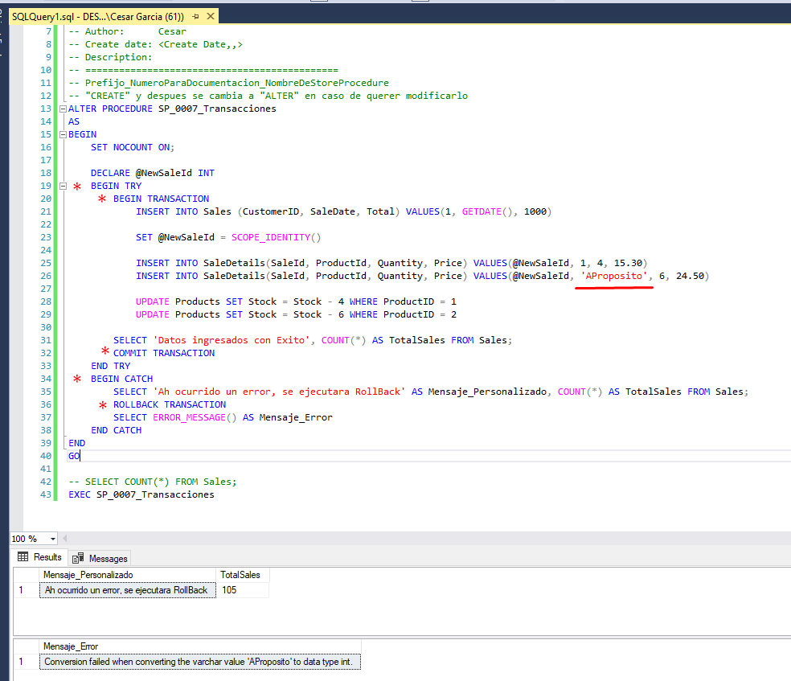
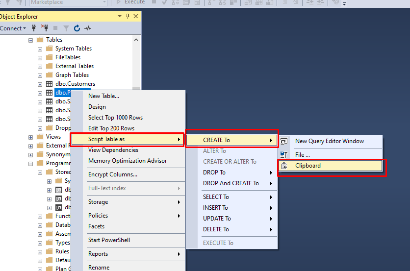
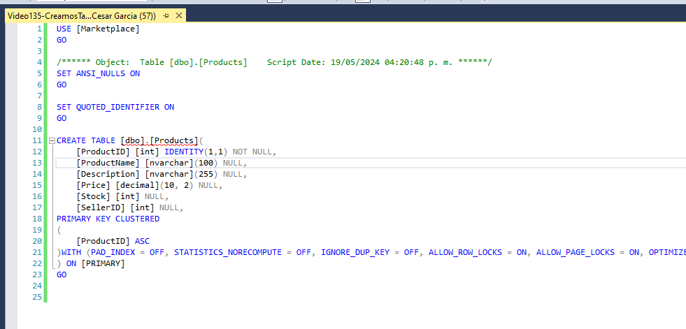
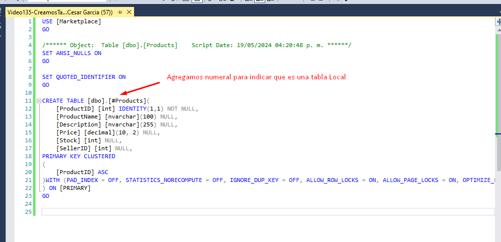
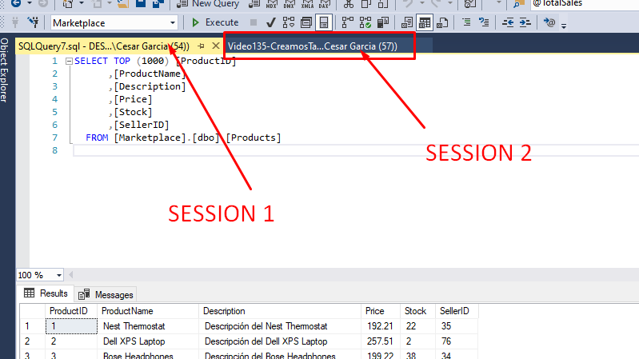
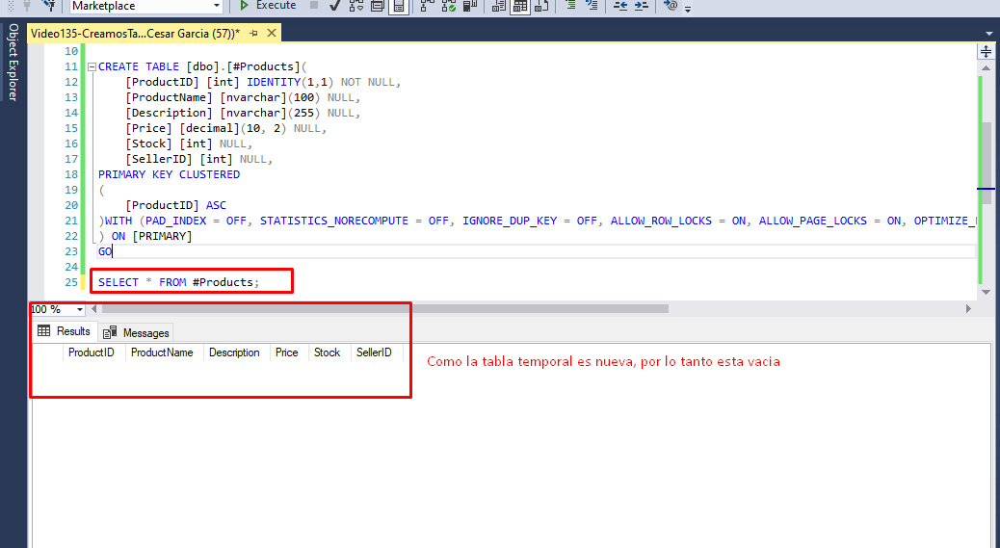
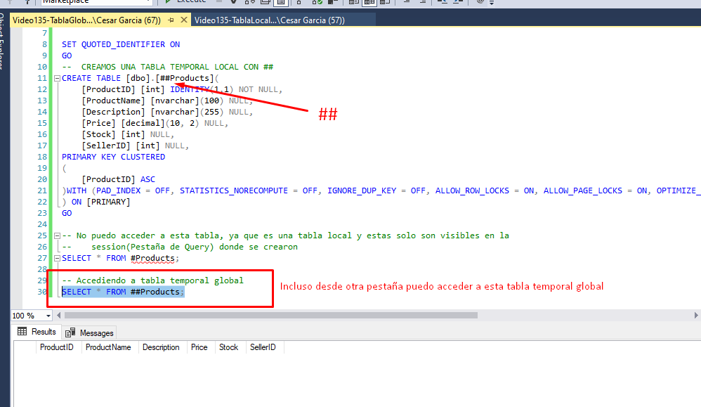

# UDY-SQLSever-ZeroAAvanzado

## Seccion 13: Stored Procedures - T-SQL

### Video 100 Que es un Stored Procedure

La forma de tener un StoreProcedure, es entrando a la carpeta de Programmability

Creamos nuestro primer StoreProcedure y ejecutamos

Ejecutamos el StoreProcedure con **EXEC** y lo corremos con F5 o el boton de Play

### Video 101 Parametros & Variables

* Para modificar el StoreProcedure hay que darle en Modify
  * 
* Agregamos Variables Inicializadas y No inicializadas
  * 
* Corremos
  * 

### Video 102 Escructuras de Decision (IF ELSE, CASE, EXISTS)

* If
  * 
* CASE
  * 

### Video 103 Escructuras de Iteracion (WHILE, RETURN & BREAK)

### Video 104 Uso de Cursores

Cursor podria ser como una especie de tabla en memoria a la cual voy a poder recorrer registro por registro

### Video 105 Manejo de Errores

* Ejemplo 1
  * 
* Ejemplo 2
  * 
* Ejemplo 3
  * 

## Seccion 14: Creando Stored Procedures reales

### Video 106 Creando el SP de Descuentos por Stock

#### **Nuevo tema aprendido CURSOR_STATUS('global', 'ProductCursor')**

El uso de `CURSOR_STATUS` en SQL Server te permite determinar el estado de un cursor, lo que es útil para manejar adecuadamente los cursores en tus procedimientos almacenados, especialmente en bloques `TRY...CATCH`. Aquí te explico cómo funciona `CURSOR_STATUS` y cómo evaluarlo para asegurar que el cursor se cierre correctamente.

##### Funcionamiento de `CURSOR_STATUS`

La función `CURSOR_STATUS` devuelve el estado del cursor especificado. Los parámetros de `CURSOR_STATUS` son:

* **global/local:** Especifica si el cursor es global o local.
* **cursor_name:** El nombre del cursor.

##### Valores Devueltos por `CURSOR_STATUS`

`CURSOR_STATUS` puede devolver los siguientes valores:

* **1:** El cursor está abierto.
* **0:** El cursor está declarado, pero no abierto.
* **-1:** El cursor no existe o ha sido cerrado.

Lo que haremos

* 
* 
  
* 

### Video 107 Creando el SP para actualizar Stock desde una venta

### Video 108 Creando el SP para listar sellers de mayor venta de acuerdo a un parametro

## SECCION 17: Manejo de Transacciones

### Video 119 Que son las transacciones?

* Son un conjunto de operaciones que se ejecutan como si fuera una sola operacion, ese conjunto se operaciones se maneja como una sola unidad.
* Por lo tanto no hay manera que haya inconsitencias de datos ya que todo se maneja en Unidad
* Una transaccion esta aislada de otras transacciones y los registros que va a modificar los tiene de alguna manera bloqueadas o aisladas para que otra transaccion no lo utilize, en operaciones donde se
* Si no se utilizan transacciones, puede haber problemas de inconsistencias.

###### SCOPE_IDENTITY()

### Video 110 Creando un SP con Transacciones

## Seccion 19: Tablas Temporales en SQL SERVER

### Video 134 Que es una tabla temporal y que tipos de tablas temporales existe?

* Una tabla temporal es una escructura de almacenamiento que permite almacenar datos de manera temporal durante la ejecucion de una consulta o una session especifica de SQL SERVER
* Estas tablas son ideales para almacenar resultados intermedios
* Cuando vimos la parte de StoreProcedure, vimos que teniamos como una especie de tabla temporal que la iterabamos a traves de un cursor.
* Estas tablas temporales ya estan determinados como tablas y objetos del sistema
* Son ideales para almacenar resultados intermedios que necesitas manipular o consultar varias veses dentro de un bloque de transacciones o una session especifica
* TENEMOS 3 TIPOS DE TABLAS TEMPORALES
  * Locales #
    * Son creadas con el prefijo numeral
    * Pueden ser accedidas por subconsultas o procediientos almacenados ejecutados dentro de una misma session
      * Es decir, que si nosotros nos hemos logueado(`NOTA: hasta ese punto todavia no tenemos una session, para tener una session necesitamos abrir un nuevo file de query que este conectado a una DB`) y creamos el file de query para tener creado una session dentro de la instancia de SQL SERVER, entonces solo nosotros vamos a poder ver esa tabla temporal, por lo tanto otros usuarios no pueden ver tablas de temporales que no fueron creados por ellos mismos
  * Globales ##
    * Se crean con doble numeral
    * Son visibles para cualquier session dentro del mismo servidor
      * Mientras el usuario que creo la tabla Global, los demas sessiones pueden ver esa tabla temporal
      * Si el creador de esa tabla temporal se cierra su session, por lo tanto la tabla temporal tambien desaparece y por lo tanto las otras sessiones ya no podran verlo
  * Tablas Temporales de Sesion
    * Son diseñados para ser mas eficientes en entornos con altas demanda de concurrencia y rendimiento
    * Al igual que las locales son solo visibles en la session local
* SQL Server 2022 Mantiene el concepto de variable de tabla
  * Se puede considerar como otro tipo de escructura temporal
  * Se declaran como `DECLARE @TablaVariable TABLE` que son las que manejamos en StoreProcedure a traves del cursor

Las tablas temporales son extremadamente utilies para realizar tareas complejas de manipulacion de datos en SQL SERVER

* Nos permite las operaciones como
  * Depuracion de datos
  * Pruebas de consultas complejas
  * Procesamiento de grandes volumenes de informacion antes de una insercion final de los mismos

### Video 135 Creamos Tablas Temporales

Truco: Supongamos que nosotros queremos crear una tabla en memoria que tenga la misma escructura de la tabla Product.

Por que es importante, imaginense que ustedes tienen que pasarle a los programadores el codigo Create de esta tabla porque lo tienen que meter dentro de la aplicacion

* Por lo tanto hacemos click en Clipboard

#### * Lo que hara es copiarlo en el Portapapeles, y eso es lo que hace falta para emular y crear la tabla temporal Product
  * 
* Agregamos el numeral para indicar que se trata de una tabla temporal local y corremos el script
  * 

**NOTA: Cuando hablamos de sesion no nos referimos al Login para conectarme a la base de datos, nos referimos al query abierto donde hacemos consultas, cada archivo de query es una session, cada una de las pestañas es una session diferente**

* Hacemos una consulta a la tabla temporal local en la sesion donde creamos la misma tabla temporal local

  * 

**VENTAJAS QUE TENEMOS CON TABLAS TEMPORALES, es que al estar alojado en memoria la consulta de datos va a ser una ejecucion muy rapida y de esa manera voy a poder darle uso**

#### Creamos una session nueva(Pestaña de query nueva) Agregamos el DOBLE numeral para indicar que se trata de una tabla temporal GLOBAL y corremos el script

* 

**NOTA.- Lo bueno de las tablas temporales globales es que puedo crear adentro un StoreProcedure, puedo grabarle informacion y cuando el store procedure termine, esa tabla va a seguir estando en memoria, mientras que la sesion que la creo, no necesariamente tiene que ser una persona, la sesion que la creo este vigente y este activa voy a seguir viendo esa tabla Global**

### Video 136 Son realmente tablas en Memoria? existen las tablas temporales en disco?

Esto es para resolver unas dudas en relacion al pasado y la actualidad.

En el pasado se podia elegir si queriamos tablas en memoria o en disco, pero lo cierto es que SQL SERVER ha evolucionado tanto que maneja la Dualidad, por lo tanto cuando nosotros creamos tabla con numeral o doble numeral(#, ##), lo que hace SQL SERVER es darle preponderancia a la memoria.

Ahora si lo que estamos grabando en esas tablas temporales compromete a la memoria, por lo tanto lo que hace SQL SERVER es empezar a grabar parte de esos datos o la totalidad de estos datos en disco, `lo graba en una carpeta que es tempdb ` y en esta carpeta va alojado todo lo que son tablas temporales, inclusive tablas de variables(las que son creadas dentro de StoreProcedure a traves del cursor).

Cuando son tablas pequeñas las empieza a alojar en memoria, pero cuando el conjunto de recursos que requiere esa tabla hace que se comprometa la memoria, entonces empieza a grabar en disco en la carpeta tempdb.

* Por lo tanto con lo que respecta a tablas temporales locales, globales y de variable
  * No hay que asumir que estaran cien por ciento en memoria
  * No hay que asumir que estaran cien por ciento en disco
* Ya que eso lo maneja y se encarga el motor de base de datos

### Video

### Video

### Video

### Video

### Video

### Video

### Video

### Video

### Video

### Video

### Video

### Video

### Video

### Video

### Video

### Video

### Video

### Video
